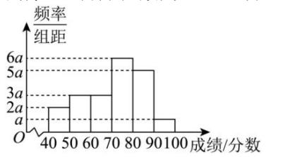

<!-- question-source:start -->
【14】（2024·天津·二模）为了加深师生对党史的了解，激发广大师生知史爱党、知史爱国的热情，某校举办了“学党史、育文化”的党史知识竞赛，并将1000名师生的竞赛成绩（满分100分，成绩取整数）整理成如图所示的频率分布直方图，估计这组数据的第85百分位数为（）分

<!-- question-source:end -->

![[Q00015185A1]]
