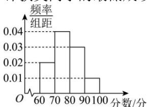

<!-- question-source:start -->
【15】（2024·高三·上海闵行·期中）某次数学竞赛有1000名学生参加，这1000名同学考试成绩的频率分布直方图如图所示，若有160名同学获奖，则估计获奖同学的最低成绩为\_\_\_\_。

第三节 用样本估计总体（2）—百分位数平均数中位数众数
<!-- question-source:end -->

![[Q00015186A1]]
