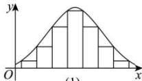
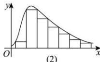
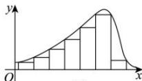

<!-- question-source:start -->
【29】（2024·黑龙江哈尔滨·三模）如图所示, 下列频率分布直方图显示了三种不同的形态. 图（1）形成对称形态, 图（2）形成“右拖尾”形态, 图（3）形成“左拖尾”形态, 根据所给图作出以下判断, 正确的是（）

A. 图（1）的平均数 $=$ 中位数 $>$ 众数
B. 图（2）的众数 $<$ 中位数 $<$ 平均数
C. 图（2）的平均数 $<$ 众数 $<$ 中位数
D. 图（3）的中位数 $<$ 平均数 $<$ 众数
<!-- question-source:end -->

![[Q00015200A1]]
