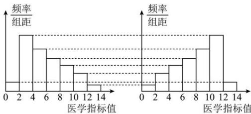

<!-- question-source:start -->
【32】（22-23 高一下·江苏无锡·期末）病毒研究所检测甲乙两组实验小白鼠的某医学指标值，得到样本数据的频率分布直方图（如图所示），则下列结论正确的是（）

甲
乙

A.甲组数据中位数大于乙组数据中位数B.甲组数据平均数大于乙组数据平均数C.甲组数据平均数大于甲组数据中位数D.乙组数据平均数大于乙组数据中位数
<!-- question-source:end -->

![[Q00015203A1]]
