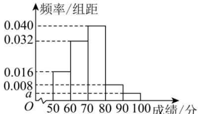

<!-- question-source:start -->
【35】（23-24 高一下·安徽亳州·期末）（多选）某学校举办了一次数学竞赛，共有 200 名参赛者，对所有参赛者的成绩进行统计，所有成绩都在 [50,100) 内，得到如图所示的频率分布直方图（每组均为左闭右开区间），则（）

A. $a = 0.04$ B.所有参赛者成绩的极差小于50
C.估计所有参赛者成绩的中位数为70.5
D.成绩在区间[60,70）内的人数为64

用样本估计总体（2）一百分位数平均数中位数众数
<!-- question-source:end -->

![[Q00015206A1]]
