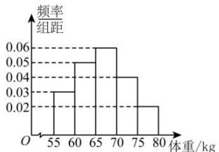

<!-- question-source:start -->
【36】为了加强对学生的营养健康监测,某校在3000名学生中,抽查了100名学生的体重数据情况.根据所得数据绘制样本的频率分布直方图如图所示,则下列结论正确的是（）

A.样本的众数为65
B.样本的第80百分位数为72.5
C.样本的平均值为67.5
D.该校学生中低于 $65\mathrm{kg}$ 的学生大约为1000人
<!-- question-source:end -->

![[Q00015207A1]]
