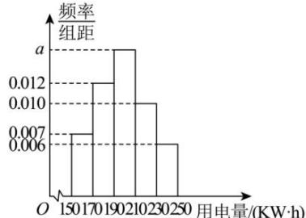

<!-- question-source:start -->
【37】（多选）某市实行居民阶梯电价收费政策后有效促进了节能减排. 现从某小区随机调查了200户家庭十月份的用电量（单位： $kW \cdot h$ ），将数据进行适当分组后（每组为左闭右开的区间），画出如图所示的频率分布直方图，则（）

A. 图中 $a$ 的值为0.015
B. 样本的第75百分位数约为217
C. 样本平均数约为198.4
D. 样本平均数小于样本中位数
<!-- question-source:end -->

![[Q00015208A1]]
