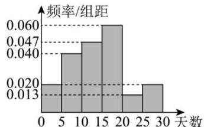

<!-- question-source:start -->
【38】（2024高一·全国·专题练习）（多选）某游泳馆统计了2023年8月1日到30日某小区居民在该游泳馆的锻炼天数,得到如图所示的频率分布直方图(将频率视为概率),则下列说法错误的是()

A. 估计该小区居民在该游泳馆的锻炼天数的平均值为 14
B. 估计该小区居民在该游泳馆的锻炼天数的众数为 18
C. 已知天数在区间[15, 20]的锻炼人数为 60, 则总共 500 人参加了锻炼
D. 估计该小区居民在该游泳馆的锻炼天数的中位数约为 14.255
<!-- question-source:end -->

![[Q00015209A1]]
