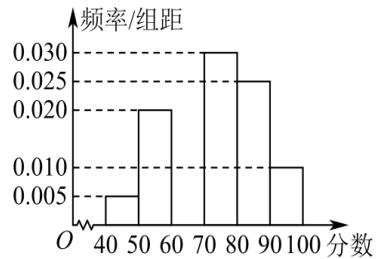

<!-- question-source:start -->
【39】（2024·云南昆明·模拟预测）（多选）某城市在创建文明城市的活动中，为了解居民对“创建文明城市”的满意程度，组织居民给活动打分（分数为整数，满分100分），从中随机抽取一个容量为100的样本，发现数据均在[40,100]内.现将这些分数分成6组并画出样本的频率分布直方图，但不小心污损了部分图形，如图所示.观察图形，则下列说法正确的是（）

A. 频率分布直方图中第三组的频数为 15
B. 根据频率分布直方图估计样本的众数为 75 分
C. 根据频率分布直方图估计样本的中位数为 74 分
D. 根据频率分布直方图估计样本的平均数为 73 分
<!-- question-source:end -->

![[Q00015210A1]]
