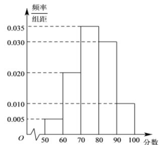

<!-- question-source:start -->
【40】（多选）某中学举行安全知识竞赛，对全校参赛的1000名学生的得分情况进行了统计，把得分数据按照[50,60),[60,70),[70,80),[80,90),[90,100]分成了5组，绘制了如图所示的频率分布直方图，根据图中信息，下列说法正确的是（）

A. 这组数据的极差为 50
B. 这组数据的众数为 76
C. 这组数据的中位数为 $\frac{540}{7}$ D. 这组数据的第 75 百分位数为 85用样本估计总体（2）—百分位数平均数中位数众数
<!-- question-source:end -->

![[Q00015211A1]]
