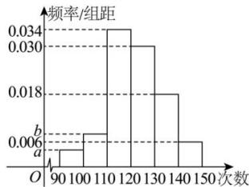

<!-- question-source:start -->
【41】（22-23 高一·甘肃兰州·月考）某市为了了解学生的体能情况，从全市所有高一学生中按90:1的比例随机抽取200人进行一分钟跳绳测试，将所得数据整理后，分为6组画出频率分布直方图（如图所示），由于操作失误，导致第一组和第二组的数据丢失，但知道第二组频率是第一组的2倍.

（1）求 $a$ 和 $b$ 的值；

（2）若次数在120以上（含120次）为优秀，试估计全市高一学生的优秀率是多少？全市优秀学生的人数约为多少？
（3）估计全市学生跳绳次数的中位数和平均数？
<!-- question-source:end -->

![[Q00015212A1]]
