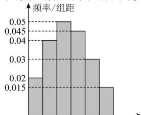

<!-- question-source:start -->
【42】（23-24 高一下·吉林白山·期末）为了解学生的周末学习时间（单位:小时），高一年级某班班主任对本班 40 名学生某周末的学习时间进行了调查，将所得数据整理绘制出如图所示的频率分布直方图,根据直方图所提供的信息,解决下列问题.

0 5 10 15 20 25 30 学习时间/小时

（1）求该班学生周末的学习时间不少于20小时的人数；
（2）①估计这40名学生周末学习时间的25%分位数；
②将该班学生周末学习时间从低到高排列, 估计第10名学生的学习时长.
<!-- question-source:end -->

![[Q00015213A1]]
