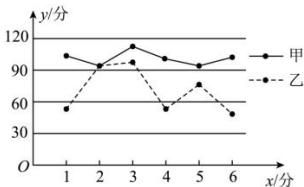

<!-- question-source:start -->
【8】（2018·贵州黔东南·二模）甲、乙两名同学6次考试的成绩统计如图所示，甲、乙两组数据的平均数分别为 $\overline{x_{甲}}$ ， $\overline{x_{乙}}$ ，标准差分别为 $s_{甲}$ ， $s_{乙}$ ，则（）

A. $x_{\text{甲}} < x_{\text{乙}}$ ， $s_{\text{甲}} < s_{\text{乙}}$ B. $x_{\text{甲}} < x_{\text{乙}}$ ， $s_{\text{甲}} > s_{\text{乙}}$ C. $\overline{x}_{\text{甲}} > \overline{x}_{\text{乙}}$ ， $s_{\text{甲}} < s_{\text{乙}}$ D. $\overline{x}_{\text{甲}} > \overline{x}_{\text{乙}}$ ， $s_{\text{甲}} > s_{\text{乙}}$
<!-- question-source:end -->

![[Q00015221A1]]
