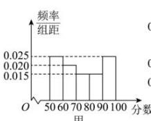
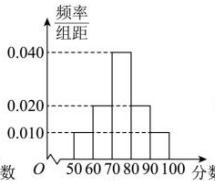
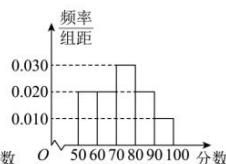

<!-- question-source:start -->
【10】（2020·广东珠海·三模）甲、乙、丙三位同学在一项集训中的40次测试分数都在[50, 100]内，将他们的测试分数分别绘制成频率分布直方图，如图所示，记甲、乙、丙的分数标准差分别为 $s_1, s_2, s_3$ ，则它们的大小关系为（）

A. $s_1 > s_2 > s_3$ B. $s_1 > s_3 > s_2$ C. $s_3 > s_1 > s_2$ D. $s_3 > s_2 > s_1$
<!-- question-source:end -->

![[Q00015223A1]]
