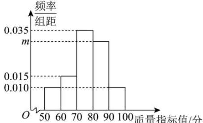

<!-- question-source:start -->
【23】（23-24 高一下·新疆乌鲁木齐·期末）某灯具配件厂生产了一种塑胶配件，该厂质检人员某日随机抽取了 100 个该配件的质量指标值（单位: 分）作为一个样本, 得到如下所示的频率分布直方图, 则（同一组中的数据用该组区间的中点值作代表）

（1）求出 m 的值；

(2)求样本质量指标值的平均数和第75百分位数;

（3）若样本质量指标值在区间[60,70)内的平均数和方差为67和51,在区间[70,80]内的平均数和方差为77和21,据此估计在[60,80]内的平均数和方差.
<!-- question-source:end -->

![[Q00015236A1]]
