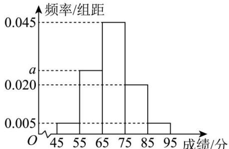

<!-- question-source:start -->
【44】（23-24 高一下·贵州铜仁·期末）2024 年 3 月 31 日, 贵州铜仁梵净山春季马拉松在梵净山赛道成功举行, 其中志愿者的服务工作是马拉松成功举办的重要保障. 铜仁市文体广电旅游局承办了志愿者选拔的面试工作. 现随机抽取了 100 名候选者的面试成绩, 并分成五组: 第一组 [45,55), 第二组 [55,65), 第三组 [65,75), 第四组 [75,85), 第五组 [85,95], 绘制成如图所示的频率分布直方图.

（1）估计这 100 名候选者面试成绩的平均数和第 80 百分位数；

（2）现从以上各组中用分层随机抽样的方法选取20人,担任本市的宣传者.若本市宣传者中第二组面试者的面试成绩的平均数和方差分别为62和40,第四组面试者的面试成绩的平均数和方差分别为80和50,请据此估计这次第二组和第四组所有面试者的面试成绩的方差.

第四节 用样本估计总体（3）一方差与标准差
<!-- question-source:end -->

![[Q00015257A1]]
