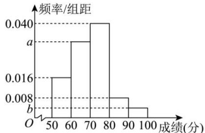

<!-- question-source:start -->
【45】（23-24 高一下·西藏拉萨·期末）2024 年 5 月 22 日至 5 月 28 日是第二届全国城市生活垃圾分类宣传周，本次宣传周的主题为“践行新时尚分类志愿行”。拉萨市某中学高一年级举行了一次“垃圾分类知识竞赛”，为了了解本次竞赛成绩情况，从中抽取了部分学生的成绩 x（单位：分，得分取正整数，满分为 100 分）作为样本进行统计将成绩进行整理后，分为五组

（50 ≤ x < 60, 60 ≤ x < 70, 70 ≤ x < 80, 80 ≤ x < 90, 90 ≤ x ≤ 100），其中第二组的频数是第一组频数的 2 倍，请根据下面尚未完成的频率分布直方图（如图所示）解决下列问题：

$$
a, b
$$

（3）某老师在此次竞赛成绩中抽取了10名学生的分数： $x_{1}$ ， $x_{2}$ ， $x_{3}$ ，……， $x_{10}$ ，已知这10个分数的平均数 $\bar{x}=80$ ，标准差 $s=\sqrt{35}$ ，若剔除其中的75和85这两个分数，求剩余8个分数的平均数与方差.
<!-- question-source:end -->

![[Q00015258A1]]
