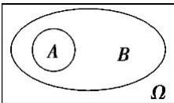
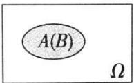

## 1. 事件的关系

<table><tr><td></td><td>定义</td><td>含义</td><td>表示法</td><td>图示</td></tr><tr><td>包含关系</td><td>一般地,对于事件A与事件B,如果事件A发生,则事件B一定发生,这时称事件B包含事件A(或称事件A包含于事件B)</td><td>A发生导致B发生</td><td> $B \supseteq A$ 或 $A \subseteq B$ </td><td></td></tr><tr><td>相等关系</td><td>如果事件B包含事件A,事件A也包含事件B,即 $B \supseteq A$ 且 $A \subseteq B$ ,则称事件A与事件B相等.</td><td>两个事件总同时发生或同时不发生</td><td> $A = B$ </td><td></td></tr></table>
