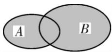
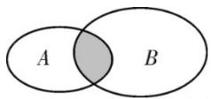

## 2. 事件的运算

<table><tr><td></td><td>定义</td><td>含义</td><td>表示法</td><td>图示</td></tr><tr><td>并事件</td><td>若某事件发生当且仅当事件A发生或事件B发生,则称此事件为事件A与事件B的并事件(或和事件)</td><td>A与B至少一个发生</td><td>A∪B或A+B</td><td></td></tr><tr><td>交事件</td><td>若某事件发生当且仅当事件A发生且事件B发生,则称此事件为事件A与事件B的交事件(或积事件)</td><td>A与B同时发生</td><td>A∩B或AB</td><td></td></tr></table>
