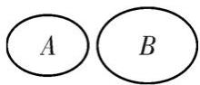
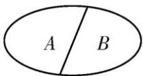

## 3. 互斥事件与对立事件

<table><tr><td></td><td>定义</td><td>含义</td><td>表示法</td><td>图示</td></tr><tr><td>互斥关系</td><td>若 $A \cap B$ 为不可能事件,则称事件 $A$ 与事件 $B$ 互斥</td><td> $A$ 与 $B$ 不能同时发生</td><td>若 $A \cap B = \varnothing$ ,则 $A$ 与 $B$ 互斥</td><td></td></tr><tr><td>对立关系</td><td>若 $A \cap B$ 为不可能事件, $A \cup B$ 为必然事件,那么称事件 $A$ 与事件 $B$ 互为对立事件,事件 $A$ 的对立事件记为 $\overline{A}$ ,故 $A$ 与 $B$ 互为对立事件可记为 $B = \overline{A}$ 或 $A = \overline{B}$ </td><td> $A$ 与 $B$ 有且仅有一个发生</td><td>若 $A \cap B = \varnothing$ , $A \cup B = U$ ,则 $A$ 与 $B$ 对立</td><td></td></tr></table>

注意:互斥事件包括对立事件,即对立事件一定是互斥事件,但互斥事件不一定是对立事件.
