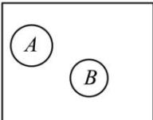
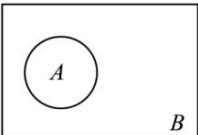

> [!faq]- 全练一本通解析
>
> > [!success]- **【答案】** D
>
> > [!note]- **【分析】**
> > 本题未单列分析。
>
> > [!note]- **【解析】**
> > $\frac{5}{12}$
> > 解析:设事件 A=“甲跑第一棒”, 事件 B=“乙跑第四棒”,
> > $$
> > P (A) = \frac {1}{4}, P (B) = \frac {1}{4}
> > $$
> > 记甲跑第 $x$ 棒，乙跑第 $y$ 棒为 $(x,y)$
> > $$
> > (1, 2), (1, 3), (1, 4), (2, 1), (2, 3)
> > $$
> > $$
> > (2, 4), (3, 1), (3, 2), (3, 4), (4, 1), (4, 2), (4, 3)
> > $$
> > 甲跑第一棒, 乙跑第四棒只有一种结果, 即 (1,4),
> > 故 $P(A \cap B) = \frac{1}{12}$ ; 所以, 甲跑第一棒或乙跑第四棒的概率为: $P(A \cup B) = P(A) + P(B) - P(A \cap B) = \frac{1}{4} + \frac{1}{4} - \frac{1}{12} = \frac{5}{12}$ .
> > 故答案为: $\frac{5}{12}$
> > # 第二节 事件的相互独立性
> > # 重点题型专练
> > 解析:对于 A 中, 把一枚硬币掷两次, 对于每次而言是相互独立的, 其结果不受先后影响, 故 A 是独立事件;
> > 对于 B: 两个事件是不放回地摸球, 显然 A 事件与 B 事件不相互独立; 对于 C, 事件 A, B 应为互斥事件, 不相互独立;
> > 解析:由于采用有放回地摸球,因此 $A_{1}$ 与 $A_{2}$ 相互独立,于是事件 $A_{1}$ 与 $\overline{A}_{2}$ 是相互独立事件.故选：A
> > 【3】A
> > 解析:由于是有放回地摸球,事件A的发生并不影响事件B的发生,故A与B,A与 $\overline{B}$ 均相互独立.故选：A
> > 【4】C
> > 解析:当事件A,B的关系如图所示时,A与B互斥,但A与 $\overline{B}$ 不互斥,A错误.
> > 
> > $A$ 与 $B$ 不相互独立时也未必是互斥事件， $B$ 错误.如果 $A$ 与 $B$ 相互独立，则 $P(AB) = P(A) \cdot P(B)$ ，依题意得 $P(A) \cdot P(B) > 0$ ，因此 $P(AB) \neq 0$ ，事件 $A$ 与事件 $B$ 一定能同时发生，故不是互斥事件， $C$ 正确.当事件 $A, B$ 的关系如图所示时， $A + B$ 是必然事件，但 $A, B$ 不是对立事件， $D$ 错误.
> > 
> > 故选：C
> > 【5】 $\frac{1}{2}$ 解析：∵每次抛硬币都是相互独立的，
> > ∴在抛掷第3个硬币时，正面朝上的概率为 $\frac{1}{2}$ ，故答案为： $\frac{1}{2}$ .
> > 解析:由题意可得 $P(A)=\frac{1}{6}$ , $P(B)=\frac{3}{6}=\frac{1}{2}$ , $P(C)=\frac{3}{6}\times\frac{3}{6}=\frac{1}{4}$ , $P(D)=\frac{3}{6}\times\frac{3}{6}+\frac{3}{6}\times\frac{3}{6}=\frac{1}{2}$ .
> > 因为 $P(AB)=\frac{1}{6}\times\frac{3}{6}=\frac{1}{12}=P(A)P(B)$ ，所以 A 与 B 相互独立，故 A 正确；
> > 因为 $P(BC)=\frac{3}{6}\times\frac{3}{6}=\frac{1}{4}\neq P(B)P(C)$ ，所以 B 与 C 不相互独立，故 B 错误；
> > 因为 $P(BD)=\frac{3}{6}\times\frac{3}{6}=\frac{1}{4}=P(B)P(D)$ ，所以 B 与 D 相互独立，故 C 正确；
> > 因为 $P(CD)=0$ ，所以 C 与 D 互斥，故 D 正确. 故选：ACD
> > 【7】A
> > 解析:由题意得 $P(A)=\frac{2}{4}=\frac{1}{2}$ ,
> > A 选项, $P(B)=\frac{2}{4}=\frac{1}{2}$ , $A\cap B=\{1\}$ , 故 $P(A\cap B)=\frac{1}{4}$ ,
> > 所以 $P(A \cap B) = P(A)P(B)$ ，故事件 A, B 相互独立，A 正确；
> > B 选项, $P(B)=\frac{3}{4}$ , $A \cap B = \{1, 2\}$ , 故 $P(A \cap B)=\frac{2}{4}=\frac{1}{2}$ ,
> > 所以 $P(A \cap B) \neq P(A)P(B)$ ，故事件 A, B 不相互独立，B 错误；
> > C 选项, $P(B)=\frac{2}{4}=\frac{1}{2}$ , $A \cap B = \varnothing$ , 故 $P(A \cap B) = 0$ ,
> > 所以 $P(A \cap B) \neq P(A)P(B)$ ，故事件 A, B 不相互独立，C 错误；
> > D 选项, $P(B)=\frac{3}{4}$ , $A \cap B = \{2\}$ , 故 $P(A \cap B)=\frac{1}{4}$ ,
> > 所以 $P(A \cap B) \neq P(A)P(B)$ ，故事件 A, B 不相互独立，D 错误；故选：A
> > 【8】D
> > 【8】D
> > 解析: 投掷这枚骰子两次, 共有 $6 \times 6 = 36$ 个基本事件, $A=\left\{(2,1),(2,2),(2,3),(2,4),(2,5),(2,6)\right\}$ 共 6 个基本事件, 则 $P(A)=\frac{6}{36}=\frac{1}{6}$ , $B=\left\{(1,3),(2,3),(3,3),(4,3),(5,3),(6,3)\right\}$ 共 6 个基本事件, 则 $P(B)=\frac{6}{36}=\frac{1}{6}$ , $C=\left\{(1,6),(2,5),(3,4),(4,3),(5,2),(6,1)\right\}$ 共 6 个基本事件, 则 $P(C)=\frac{6}{36}=\frac{1}{6}$ , $D=\left\{(2,6),(3,5),(4,4),(5,3),(6,2)\right\}$ 共 5 个基本事件, 则 $P(D)=\frac{5}{36}$ ,
> > 事件 CD 为不可能事件, 则 $P(CD)=0\neq P(C)P(D)$ ,
> > 所以 C 与 D 不相互独立, 故 A 错误;
> > 事件 $AD=\left\{(2,6)\right\}$ 共 1 个基本事件, 则 $P(AD)=\frac{1}{36}\neq P(A)P(D)$ ,
> > 所以 A 与 D 不相互独立, 故 B 错误;
> > 事件 $BD=\left\{(5,3)\right\}$ 共 1 个基本事件, 则 $P(BD)=\frac{1}{36}\neq P(B)P(D)$ ,
> > 所以 B 与 D 不相互独立, 故 C 错误;
> > 事件 $BC=\left\{(4,3)\right\}$ 共 1 个基本事件, 则 $P(BC)=\frac{1}{36}=P(B)P(C)$ ,
> > 所以 B 与 C 相互独立, 故 D 正确. 故选: D.
> > 【9】D
> > 解析:由题意可得基本事件总数为 $4 \times 4 = 16$ ,
> > 设 $A=\left\{(3,2),(3,3),(3,4),(3,5)\right\}$ $B=\left\{(1,2),(2,2),(3,2),(4,2),(1,4),(2,4),(3,4),(4,4)\right\}$ $C=\left\{(2,5),(3,4),(4,3)\right\}$ , $D=\left\{(1,3),(1,5),(3,3),(3,5),(2,2),(2,4),(4,2),(4,4)\right\}$
> > 易知 C 与 D 不同时发生, 为互斥事件, 但不是对立事件, 比如还可以有 (2,3) 发生, 则 B, C 错误. $P(A)=\frac{1}{4}, P(B)=\frac{1}{2}, P(C)=\frac{3}{16}, P(D)=\frac{1}{2}, P(AC)=\frac{1}{16}, P(BD)=\frac{1}{4}$ ,
> > 则 $P(AC) \neq P(A)P(C), P(BD) = P(B)P(D)$ ,
> > 从而 A 与 C 不相互独立, B 与 D 相互独立, 故 A 错误, D 正确. 故选: D
> > 【10】B
> > 解析: 因为 $n(\Omega)=12, n(A)=6, n(B)=4, n(A \cup B)=8$ ,
> > 所以 $n(A \cap B)=2, n(A \cap \overline{B})=4, n(\overline{B})=8$ , 所以事件 A 与事件 $\overline{B}$ 不是互斥事件,
> > 所以 $P(A\overline{B})=\frac{4}{12}=\frac{1}{3}, P(A)P(\overline{B})=\frac{6}{12} \times \frac{8}{12}=\frac{1}{3}$ ,
> > 所以 $P(A\overline{B})=P(A)P(\overline{B})$ , 所以事件 A 与事件 $\overline{B}$ 是独立事件. 故选: B.
> > 【11】AD
> > 解析:有三个小孩的家庭的样本空间: $\Omega=\{(\text{男,男,男}),(\text{男,男,女}),(\text{男,女,男}),(\text{女,男,男}),(\text{男,女,女})$ ,
> > （女,男,女），（女,女,男），（女,女,女），
> > 事件 $A=\{(\text{男,男,女}),(\text{男,女,男}),(\text{女,男,男}),(\text{男,女,女})$ ,
> > （女,男,女），（女,女,男）}
> > 事件 $B=\{(\text{男,女,女}),(\text{女,男,女}),(\text{女,女,男}),(\text{女,女,女})\}$ ,
> > 事件 $C=\{(\text{男,男,男}),(\text{男,男,女}),(\text{男,女,男}),(\text{女,男,男})\}$ 对于 A， $B \cap C = \varnothing$ ，且 $B \cup C = \Omega$ ，则事件 B 与事件 C 互斥且对立，A 正确；
> > 对于 B， $A \cap B = \{(\text{男,女,女}),(\text{女,男,女}),(\text{女,女,男})\}$ 则事件 A 与事件 B 不互斥，B 错误；
> > 对于 C，事件 B 有 4 个样本点，事件 C 有 4 个样本点，事件 BC 有 0 个样本点， $P(B)=\frac{4}{8}=\frac{1}{2},P(C)=\frac{4}{8}=\frac{1}{2},P(BC)=0$ ，显然 $P(B) \cdot P(C) \neq P(BC)$ 即事件 B 与事件 C 不相互独立，C 错误；
> > 对于 D，事件 A 有 6 个样本点，事件 B 有 4 个样本点，事件 AB 有 3 个样本点，
> > $P(A)=\frac{6}{8}=\frac{3}{4},P(B)=\frac{4}{8}=\frac{1}{2},P(AB)=\frac{3}{8}$ ，显然 $P(A)\cdot P(B)=P(AB)$ ，
> > 即事件A与事件B相互独立，D正确。故选：AD
> > 【12】（1）0.24；（2）0.14；（3）0.94
> > 解析：（1）设A=“甲命中”，B=“乙命中”，则 $A\cup B=$ “甲或乙命中”， $A\cap\overline{B}=$ “甲中、乙不中”， $\overline{A}\cap B=$ “甲不中、乙中”，且 $P(A)=0.8, P(B)=0.7$ 甲乙中靶与否独立，故 $P(A\cap\overline{B})=P(A)P(\overline{B})=0.8\times0.3=0.24$ 。
> > （2） $P(\overline{A}\cap B)=P(\overline{A})P(B)=0.2\times0.7=0.14$ 。
> > （3） $P(A\cup B)=P(A)+P(B)-P(A\cap B)=P(A)+P(B)-P(A)P(B)=0.94$ 。
> > 【13】 $\frac{1}{24}$ 解析：由于三个人射击是相互独立的，根据相互独立事件的概率公式 $P(A_{1}A_{2}\cdots A_{n})=P(A_{1})P(A_{2})\cdots P(A_{n})$ ，故全中靶心的概率为 $\frac{1}{3}\cdot\frac{1}{2}\cdot\frac{1}{4}=\frac{1}{24}$ 。
> > 【14】C
> > 解析：根据相互独立事件的概率公式 $P(A_{1}A_{2}\cdots A_{n})=P(A_{1})P(A_{2})\cdots P(A_{n})$ ，依题意，该同学种植的3棵树都成活的概率为 $\frac{4}{5}\times\frac{3}{4}\times\frac{4}{5}=\frac{12}{25}$ 。故选：C
> > 【15】C
> > 解析：设甲外出旅游为事件A，乙外出旅游为事件B，事件“甲、乙两位同学恰有一人外出旅游”为 $\overline{AB}+\overline{AB}$ ，由题意 $P(A)=\frac{2}{3}, P(B)=\frac{3}{4}$ ，
> > 所以 $P(\overline{AB}+\overline{AB})=P(A)P(\overline{B})+P(\overline{A})P(B)=\frac{2}{3}\times(1-\frac{3}{4})+(1-\frac{2}{3})\times\frac{3}{4}=\frac{5}{12}$ 。
> > 故选：C.
> > 【16】 $\frac{6}{25};\frac{24}{25}$ 解析：A、B、C三人将参加某项测试，三人都能达标的概率是 $\frac{4}{5}\times\frac{3}{5}\times\frac{1}{2}=\frac{6}{25}$ ;
> > A、B、C三人将参加某项测试，都没有达标的概率是 $(1-\frac{4}{5})\times(1-\frac{3}{5})\times(1-\frac{1}{2})=\frac{1}{25}$ ，因此A、B、C三人将参加某项测试，三人中至少有一人能达标的概率是 $1-\frac{1}{25}=\frac{24}{25}$ 。
> > 【17】C
> > 解析：因为事件A与B相互独立，且 $P(A)=\frac{2}{3}, P(B)=\frac{1}{4}$ ，
> > 所以 $P(AB)=P(A)P(B)=\frac{1}{6}$ ，
> > 所以 $P(A\cup B)=P(A)+P(B)-P(AB)=\frac{2}{3}+\frac{1}{4}-\frac{1}{6}=\frac{3}{4}$ 故选：C
> > 【18】 $\frac{83}{125}$ 解析：由于三个人都当选的概率为 $\frac{4}{5}\times\frac{3}{5}\times\frac{7}{10}=\frac{84}{250}=\frac{42}{125}$ ，故至多有两人当选的概率为 $1-\frac{42}{125}=\frac{83}{125}$ 。
> > 【19】C
> > 解析：由题意，电子元件A与B至少有一个正常工作的概率为： $P_{1}=1-P(\overline{A})P(\overline{B})=1-(1-0.8)(1-0.7)=0.94$ 所以该控制模块能正常工作的概率为 $P=P_{1}\cdot P(C)=0.94\times0.6=0.564$ 。故选：C.
> > 【20】D
> > 解析：设甲、乙、丙获得一等奖的概率分别是 $P(A)=\frac{1}{2}, P(B)=\frac{2}{3}, P(C)=\frac{3}{4}$ ，
> > 则不获一等奖的概率分别是 $P(\overline{A})=1-\frac{1}{2}=\frac{1}{2}, P(\overline{B})=1-\frac{2}{3}=\frac{1}{3}, P(\overline{C})=1-\frac{3}{4}=\frac{1}{4}$ ，
> > 则这三人中恰有两人获得一等奖的概率为： $P(\overline{ABC})+P(\overline{ABC})+P(\overline{ABC})=P(\overline{A})P(B)P(C)+P(A)P(\overline{B})P(C)+P(A)P(B)$ $=\frac{1}{2}\times\frac{2}{3}\times\frac{3}{4}+\frac{1}{2}\times\frac{1}{3}\times\frac{3}{4}+\frac{1}{2}\times\frac{2}{3}\times\frac{1}{4}=\frac{11}{24}$ 这三人都获得一等奖的概率为 $P(ABC)=P(A)P(B)P(C)=\frac{1}{2}\times\frac{2}{3}\times\frac{3}{4}=\frac{1}{4}$ 所以这三人中至少有两人获得一等奖的概率 $P=\frac{11}{24}+\frac{1}{4}=\frac{17}{24}$ 。故选：D.
> > 【21】D
> > 解析:由题意可知, $\left\{\begin{aligned}\frac{1}{4}mn&=\frac{1}{40}\\ 1-(1-m)&\left(1-\frac{1}{4}\right)(1-n)=\frac{7}{10}\end{aligned}\right.$ ，得 $\left\{\begin{aligned}mn&=\frac{1}{10}\\ (1-m)(1-n)&=\frac{2}{5}\end{aligned}\right.$ 即 $\left\{\begin{aligned}mn&=\frac{1}{10}\\ 1-(m+n)+mn&=\frac{2}{5}\end{aligned}\right.$ ，解得： $m+n=\frac{7}{10}$ . 故选：D
> > 【22】C
> > 解析:用 $A_{i}$ 表示事件“第i局甲胜”， $B_{j}$ 表示事件“第j局乙胜”
> > (i,j=3,4,5)，A表示事件“甲为胜方”.
> > 因前两局中，甲、乙各胜一局，故甲成为胜方当且仅当在后面的比赛中，
> > 甲先胜2局，
> > 从而 $B=A_{3}\cdot A_{4}+B_{3}\cdot A_{4}\cdot A_{5}+A_{3}\cdot B_{4}\cdot A_{5}$ ，由于各局比赛结果相互独立，
> > 所以 $P(A)=0.6\times0.6+0.4\times0.6\times0.6+0.6\times0.4\times0.6=0.648$ ，故选：C.
> > 【23】A
> > 解析：A 每次射击，命中机首、机中、机尾的概率分别为 0.2、0.4、0.1，未命中敌机的概率为 0.3，且各次射击相互独立，若 A 射击一次就击落敌机，则他击中利敌机的机尾，故概率为 0.1；若 A 射击 2 次就击落敌机，则他 2 次都击中利敌机的机首，概率为 $0.2 \times 0.2 = 0.04$ ；或者 A 第一次没有击中机尾、且第二次击中了机尾，概率为 $0.9 \times 0.1 = 0.09$ ，若 A 至多射击两次，则他能击落敌机的概率为 $0.1 + 0.04 + 0.09 = 0.23$ ，故选 A。
> > 【24】ABD
> > 解析: 记第一次投篮命中为事件 A，第二次投篮命中为事件 B，第三次投篮命中为事件 C，
> > 则 $P(A)=0.2, P(B)=0.6, P(C)=0.6$ 对于 A：小明测试得 3 分为事件 $\overline{ABC}$ ，
> > 则 $P(\overline{A}\overline{B}\overline{C})=P(A)\overline{P(\overline{B})}\overline{P(\overline{C})}=0.2\times(1-0.6)(1-0.6)=0.032$ ，故 A 正确；
> > 对于 B：小明测试得 5 分为事件 $\overline{A}\overline{B}C\cup AB$ ，
> > 则 $P(\overline{A}\overline{B}C\cup AB)=P(\overline{A}\overline{B}C)+P(AB)=P(A)\overline{P(\overline{B})}P(C)+P(A)P(B)=0.2\times0.4\times0.6+0.2\times0.6=0.168$ ，故 B 正确；
> > 对于 C：小明测试一共投篮 3 次为事件 $\overline{A}\overline{B}\cup\overline{A}\overline{B}\cup\overline{A}\overline{B}$ ， $P(A\overline{B}\cup\overline{A}B)=P(A\overline{B})+P(\overline{A}B)+P(\overline{A}\overline{B})=0.2\times0.4+0.8\times0.6+0.8\times0.4=0.88$ ，故 C 错误；
> > 对于 D：小明测试通过为事件 $AB\cup\overline{ABC}\cup\overline{ABC}$ ， $P(AB\cup\overline{ABC}\cup\overline{ABC})=P(AB)+P(\overline{ABC})+P(\overline{ABC})=0.2\times0.6+0.8\times0.6\times0.6+0.2\times0.4\times0.6=0.456$ ，故 D 正确。故选：ABD。
> > 【25】（1） $\frac{1}{9}$ ; （2） $\frac{1}{6}$ 解析:(1)设甲第一次击中目标为事件 $A_{1}$ ，甲第二次击中目标为事件 $A_{2}$ ，
> > 则 $P(A_{1})=P(A_{2})=\frac{2}{3}$ .
> > 因为事件“甲两次都没有击中目标”即为事件 $\overline{A}_{1}\overline{A}_{2}$ ，
> > 则所求的概率为 $P(\overline{A}_{1}\overline{A}_{2})=P(\overline{A}_{1})P(\overline{A}_{2})=(1-P(A_{1}))(1-P(A_{2}))=\frac{1}{9}$ .
> > （2）设乙第一次击中目标为事件 $B_{1}$ ，乙第二次击中目标为事件 $B_{2}$ ，
> > 则 $P(B_{1})=P(B_{2})=\frac{3}{4}$ .
> > 所以事件“四次射击中，甲、乙恰好各击中一次目标”表示为 $\overline{A}_{1}A_{2}\overline{B}_{1}B_{2}+A_{1}\overline{A}_{2}\overline{B}_{1}B_{2}+\overline{A}_{1}A_{2}B_{1}\overline{B}_{2}+A_{1}\overline{A}_{2}B_{1}\overline{B}_{2}$ 所以所求的概率为 $P=P\left(\overline{A}_{1}A_{2}\overline{B}_{1}B_{2}+A_{1}\overline{A}_{2}\overline{B}_{1}B_{2}+\overline{A}_{1}A_{2}B_{1}\overline{B}_{2}+A_{1}\overline{A}_{2}B_{1}\overline{B}_{2}\right)$ $=P\left(\overline{A}_{1}A_{2}\overline{B}_{1}B_{2}\right)+P\left(A_{1}\overline{A}_{2}\overline{B}_{1}B_{2}\right)+P\left(\overline{A}_{1}A_{2}B_{1}\overline{B}_{2}\right)+P\left(A_{1}\overline{A}_{2}B_{1}\overline{B}_{2}\right)$ $=4\times\frac{2}{3}\times\frac{1}{3}\times\frac{3}{4}\times\frac{1}{4}=\frac{1}{6}$
> > 【26】详见解析
> > 解析：（1）设甲两轮至少猜对一个数学名词为事件 F，则 $P(F)=2\times\frac{4}{5}\times\frac{1}{5}+\left(\frac{4}{5}\right)^{2}=\frac{8}{25}+\frac{16}{25}=\frac{24}{25}$ （2）设事件 A = “甲第一轮猜对”，B = “乙第一轮猜对”，C = “甲第二轮猜对”，D = “乙第二轮猜对”，E = ““博学队”猜对三个数学名词”，所以
> > $P(A)=P(C)=\frac{4}{5},P(B)=P(D)=\frac{3}{5},$ $P(\overline{A})=P(\overline{C})=\frac{1}{5},P(\overline{B})=P(\overline{D})=\frac{2}{5}$ ，则 $E=\overline{A}BCD\cup\overline{A}\overline{B}CD\cup AB\overline{C}D\cup ABC\overline{D}$ ，
> > 由事件的独立性与互斥性，得 $P(E)=P(\overline{A}BCD)+P(A\overline{B}CD)+P(AB\overline{C}D)+P(ABC\overline{D})$ $=P(\overline{A})P(B)P(C)P(D)+P(A)P(\overline{B})P(C)P(D)+P(A)P(B)P(\overline{C})P(D)$ $+P(A)P(B)P(C)P(\overline{D})$ $=\frac{1}{5}\times\frac{3}{5}\times\frac{4}{5}\times\frac{3}{5}+\frac{4}{5}\times\frac{2}{5}\times\frac{4}{5}\times\frac{3}{5}+\frac{4}{5}\times\frac{3}{5}\times\frac{1}{5}\times\frac{3}{5}+\frac{4}{5}\times\frac{3}{5}\times\frac{4}{5}\times\frac{2}{5}=\frac{264}{625}$ ，
> > 故“博学队”在两轮比赛中猜对三个数学名词的概率为 $\frac{264}{625}$ .
> > 【27】详见解析
> > 解析：（1）记“甲家庭回答正确这道题”为事件 A，“乙家庭回答正确这道题”为事件 B，
> > “丙家庭回答正确这道题”为事件 C，
> > 则 $P(A)=\frac{2}{3}$ ， $P(\overline{A})P(\overline{C})=\frac{1}{15}$ ， $P(B)P(C)=\frac{3}{5}$ ，
> > 即 $[1-P(A)][1-P(C)]=\frac{1}{15}$ ， $P(B)P(C)=\frac{3}{5}$ ，
> > 所以 $P(B)=\frac{3}{4}$ ， $P(C)=\frac{4}{5}$ ，
> > 所以乙、丙两个家庭各自回答正确这道题的概率分别为 $\frac{3}{4}$ ， $\frac{4}{5}$ ；
> > （2）有3个家庭回答正确的概率为 $P_{3}=P(ABC)=P(A)P(B)P(C)=\frac{2}{3}\times\frac{3}{4}\times\frac{4}{5}=\frac{2}{5}$ 有2个家庭回答正确的概率为： $P_{2}=P(\overline{A}BC+A\overline{B}C+AB\overline{C})=\frac{1}{3}\times\frac{3}{4}\times\frac{4}{5}+\frac{2}{3}\times\frac{1}{4}\times\frac{4}{5}+\frac{2}{3}\times\frac{3}{4}\times\frac{1}{5}=\frac{13}{30}$ 所以不少于2个家庭回答正确这道题的概率 $P=P_{2}+P_{3}=\frac{13}{30}+\frac{2}{5}=\frac{5}{6}$ .
> > 【28】（1） $\frac{1}{2}$ ; （2） $\frac{16}{81}$ ;
> > 解析：（1）用事件 A 表示“甲击中目标”，事件 B 表示“乙击中目标”。依题意知，事件 A 和事件 B 相互独立，因此甲、乙各射击一次均击中目标的概率为 $P(AB)=P(A)P(B)=\frac{2}{3}\times\frac{3}{4}=\frac{1}{2}$
> > （2）用事件 $A_{i}$ 表示“甲第 $i(i=1,2,3,4)$ 次射击中目标”，并记“甲射击4次，恰有3次连续击中目标”为事件C，则 $C=A_{1}A_{2}A_{3}\overline{A}_{4}\cup\overline{A}_{1}A_{2}A_{3}A_{4}$ ，且 $A_{1}A_{2}A_{3}\overline{A}_{4}$ 与 $\overline{A}_{1}A_{2}A_{3}A_{4}$ 是互斥事件.
> > 由于 $A_{1}, A_{2}, A_{3}, A_{4}$ 之间相互独立，
> > 所以 $A_{i}$ 与 $\overline{A}_{j}$ （i, j=1,2,3,4，且 $i\neq j$ ）之间也相互独立.
> > 由于 $P(A_{1})=P(A_{2})=P(A_{3})=P(A_{4})=\frac{2}{3}$ ,
> > 所以 $P(\overline{A}_{1})=P(\overline{A}_{2})=P(\overline{A}_{3})=P(\overline{A}_{4})=\frac{1}{3}$ ,
> > 故 $P(C)=P\left(A_{1}A_{2}A_{3}\overline{A}_{4}\cup\overline{A}_{1}A_{2}A_{3}A_{4}\right)$ $=P(A_{1})P(A_{2})P(A_{3})P(\overline{A}_{4})+P(\overline{A}_{1})P(A_{2})P(A_{3})P(A_{4})$ $=\left(\frac{2}{3}\right)^{3}\times\frac{1}{3}+\frac{1}{3}\times\left(\frac{2}{3}\right)^{3}=\frac{16}{81}$ .
> > 所以甲射击4次，恰有3次连续击中目标的概率为 $\frac{16}{81}$ .
> > 【29】（1） $\frac{1}{3}$ （2） $\frac{64}{81}$
> > 解析：（1）设事件 $E_{i} =$ “甲第 $i$ 局获胜”，事件 $A =$ “经过3局比赛，对抗赛结束”，由题意知，前3局比赛中，甲全胜或者全负，即 $A = E_{1}E_{2}E_{3}\cup \overline{E}_{1}\overline{E}_{2}\overline{E}_{3},$ $P\left(E_1E_2E_3\right) = \left(\frac{2}{3}\right)^3 = \frac{8}{27},$ $P\left(\overline{E}_1\overline{E}_2\overline{E}_3\right) = \left(1 - \frac{2}{3}\right)^3 = \frac{1}{27},$
> > 于是 $P(A) = P\left(E_1E_2E_3\cup \overline{E}_1\overline{E}_2\overline{E}_3\right) = P\left(E_1E_2E_3\right) + P\left(\overline{E}_1\overline{E}_2\overline{E}_3\right) = \frac{8}{27} +\frac{1}{27} = \frac{1}{3}$ 经过3局比赛，对抗赛结束的概率为 $\frac{1}{3}$ （2）设事件 $B =$ “甲赢得对抗赛”， $B_{i} =$ “经过 $i$ 局比赛，甲赢得对抗赛”， $i = 3,4,5$ 则 $B = B_{3}\cup B_{4}\cup B_{5}$ 若 $i = 3$ ，则甲、乙的积分之比为 $3:0,P(B_{3}) = P(E_{1}E_{2}E_{3}) = \frac{8}{27}$ 若 $i = 4$ ，则甲、乙的积分之比为3:1，即在前三局比赛中，甲胜两局负一局，第四局甲获胜，所以 $P(B_4) = P\left(\overline{E}_1E_2E_3E_4\cup E_1\overline{E}_2E_3E_4\cup E_1E_2\overline{E}_3E_4\right)$ $= P\left(\overline{E}_1E_2E_3E_4\right) + P\left(E_1\overline{E}_2E_3E_4\right) + P\left(E_1E_2\overline{E}_3E_4\right)$ $= 3\times \left(\frac{2}{3}\right)^{2}\times \left(\frac{1}{3}\right)\times \left(\frac{2}{3}\right) = \frac{8}{27};$ 若 $i = 5$ ，则甲、乙的积分之比为 $3:2$ ，即在前四局比赛中，甲、乙两人各胜两局，第五局甲获胜，所以 $P(B_{5}) = P\left(\overline{E}_{1}\overline{E}_{2}E_{3}E_{4}E_{5}\cup \overline{E}_{1}E_{2}\overline{E}_{3}E_{4}E_{5}\cup \overline{E}_{1}E_{2}E_{3}\overline{E}_{4}E_{5}\right.$ $\cup E_1\overline{E}_2\overline{E}_3E_4E_5\cup E_1\overline{E}_2E_3\overline{E}_4E_5\cup E_1E_2\overline{E}_3\overline{E}_4E_5)$ $= P\left(\overline{E}_1\overline{E}_2E_3E_4E_5\right) + P\left(\overline{E}_1E_2\overline{E}_3E_4E_5\right) + P\left(\overline{E}_1E_2E_3\overline{E}_4E_5\right.)$ $+P\left(E_{1}\overline{E}_{2}\overline{E}_{3}E_{4}E_{5}\right) + P\left(E_{1}\overline{E}_{2}E_{3}\overline{E}_{4}E_{5}\right) + P\left(E_{1}E_{2}\overline{E}_{3}\overline{E}_{4}E_{5}\right)$ $= 6\times \left(\frac{2}{3}\right)^{2}\times \left(\frac{1}{3}\right)^{2}\times \frac{2}{3} = \frac{16}{81};$ 故 $P(B) = P(B_{3}\cup B_{4}\cup B_{5}) = P(B_{3}) + P(B_{4}) + P(B_{5}) = \frac{8}{27} +\frac{8}{27} +\frac{16}{81} = \frac{64}{81}.$
> > # 第三节 频率与概率
> > # 核心基础达标
> > 【1】C
> > 解析:必然事件发生的概率为 1, 不可能事件发生的概率为 0, 故 A 错; 频率是由试验的次数决定的, 故 B 错;
> > 概率是频率的稳定值, 故 C 正确, D 错. 故选: C.
> > 【2】D
> > 解析: 概率本身是一个在 $[0,1]$ 内的确定值, 不随试验结果的改变而改变, 故 AB 错误;
> > 频率本身是随机的, 在试验之前是无法确定的, 在相同条件下做同样次数的重复试验, 得到的事件的频率值也可能会不同, 故 C 错误, D 正确. 故选: D
> > 【3】C
> > 解析:对于①:频数是指事件发生的次数,频率是指本次试验中事件发生的次数
> > 与试验总次数的比值,二者都可以反映频繁程度,故①正确;
> > - **对于②**：试验的总次数即为各个试验结果出现的频数和,故②正确;
> > - **对于③**：各个试验结果的频率之和一定等于1,故③错误;
> > - **对于④**：概率是大量重复试验后频率的稳定值,故④错误;故选:C.
> > 解析:某同学用一枚质地均匀的硬币做了1000次试验,发现正面朝上出现了560次,那么出现正面朝上的频率为 $\frac{560}{1000}=0.56$ ,
> > 由于每次抛硬币时, 正面朝上和反面朝上的机会相等, 都是 $\frac{1}{2}$ ,
> > $$
> > \frac {1}{2} = 0. 5
> > $$
> > 【5】C
> > 解析: 概率是频率的稳定值, A 发生的概率等于 $\frac{1}{2}$ , 故 AB 错误; A 在这十次试验中发生的频率为 $\frac{6}{10} = \frac{3}{5}$ , 故 C 正确, D 错误. 故选: C
> > 【6】B
> > 解析: 设白色围棋子的数目为 n, 则由已知可得 $\frac{5}{20} = \frac{100}{n + 100}$ , 解得 n = 300, 即白色围棋子的数目大约有 300 颗. 故选: B.
> > 【7】B
> > 解析:击中的环数不小于8的频率为 $\frac{12+13+8}{60}=0.55$ ，因此估计相应概率为0.55。故选:B
> > 【8】C
> > 解析:根据题意,抽样取米一把,数得254粒内夹谷28粒,则样本中夹谷的频率为 $\frac{28}{254}=\frac{14}{127}$ ,则这批米内夹谷约为 $1534\times\frac{14}{127}\approx169$ （石),故选:C
> > 【9】B
> > 解析:由题意可知表示今后的3天中恰有2天发布高温橙色预警信号的随机数有:116 812 730 217 109 361 284 147 318 027 共10个,故今后的3天中恰有2天发布高温橙色预警信号的概率估计是 $\frac{10}{20}=\frac{1}{2}$ ,故选:B
> > 【10】D
> > 解析: 设事件 A = “三天中至少有两天下雨”, 20 个随机数中, 至少有两天下雨有 123,435,525,332,152,534,512,541,135,334,151,312,354, 即事件 A 发生了 13 次, 用频率估计事件 A 的概率近似为 $\frac{13}{20}$ . 故选: D.
> > 【11】A
> > 解析:由题意可知,随机模拟试验产生了如下20组随机数中,代表“3次中至少两次投中8环以上”的数组共18组,因此,该选手投掷1轮,可以拿到优秀的概率为 $\frac{18}{20}=\frac{9}{10}$ .故选:A.
> > 【12】D
> > 解析: ∵ 射击 4 次至多击中 2 次对应的随机数组为
> > 7140, 1417, 0371, 6011, 7610, 共 5 组,
> > ∴ 射击 4 次, 至少击中 3 次的概率为 $1 - \frac{5}{20} = 0.75$ .
> >
> > 故选 **D**
