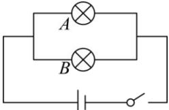

<!-- question-source:start -->
【5】（2024·高二·四川巴中·期末）如图，由 A, B 两盏正常的小灯泡组成并联电路，当闭合开关时，下列事件为必然事件的是（）

A. $A$ 灯亮, $B$ 灯不亮 B. $A$ 灯不亮, $B$ 灯亮 C. $A, B$ 两盏灯均亮 D. $A, B$ 两盏灯均不亮
<!-- question-source:end -->

![[Q00015263A1]]
