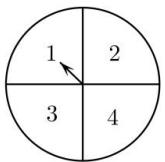
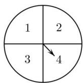

<!-- question-source:start -->
【6】（21-22 高一·全国·课后作业）同时转动如图所示的两个转盘，记转盘①得到的数为 x，转盘②得到的数为 y.

①
②

（1）写出这个试验的样本点.

（2）“ $x + y = 5$ ”这一事件包含哪几个样本点？“ $x < 3$ 且 $y > 1$ ”呢？

（3）“ $xy = 4$ ”这一事件包含哪几个样本点？“ $x = y$ ”呢？
<!-- question-source:end -->

![[Q00015264A1]]
