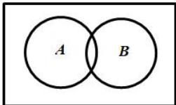

<!-- question-source:start -->
【10】（22-23 高二上·江苏南京·期初）已知一个古典概型的样本空间 $\Omega$ 和事件 A, B 如图所示．其中 $n(\Omega)=12, n(A)=6, n(B)=4, n(A \cup B)=8$ ，则事件 A 与事件 $\overline{B}$ （）

A.是互斥事件,不是独立事件
B.不是互斥事件,是独立事件
C.既是互斥事件,也是独立事件
D.既不是互斥事件,也不是独立事件
<!-- question-source:end -->

![[Q00015334A1]]
