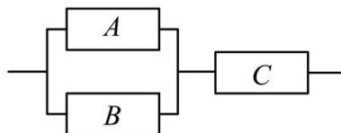

<!-- question-source:start -->
【19】（2024·高一·安徽滁州·期末）某校课外活动兴趣小组设计一控制模块，电路如右图所示，当且仅当电子元件 A, B 至少有一个正常工作，且电子元件 C 正常工作，控制模块才能正常工作。已知电子元件 A, B, C 正常工作的概率分别为 0.8, 0.7, 0.6，则该控制模块能正常工作的概率为（）

A. 0.704 B. 0.644 C. 0.564 D. 0.336
<!-- question-source:end -->

![[Q00015343A1]]
