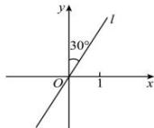

<!-- question-source:start -->
【1】直线 l 的倾斜角 $\alpha$ 的取值范围是（）
A. $\alpha\in[0,\pi]$ B. $\alpha\in\left[0,\frac{\pi}{2}\right)\cup\left(\frac{\pi}{2},\pi\right]$ C. $\alpha\in\left[0,2\pi\right)$ D. $\alpha\in\left[0,\pi\right)$

<!-- question-source:end -->

![[Q00006932A1]]
