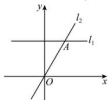

> [!faq]- 全练一本通解析
> **【解析】**
> -4 或 1
> 解析: 若 a=0，则直线 $l_{1}$ 的斜率为 0，此时直线 $l_{2}$ 的斜率不存在，那么 $l_{1}$ 与 $l_{2}$ 不平行，不满足条件，
> 若 a≠0，则直线 $l_{1}$ 的斜率为 $\frac{3a-0}{1-(-2)}=a$ ，直线 $l_{2}$ 的斜率为 $\frac{-3a-(4)}{a-0}=\frac{4-3a}{a}$ ，因为 $l_{1}//l_{2}$ ，所以 a= $\frac{4-3a}{a}$ ，即 a² +3a -4 =0，解得：a=1 或 a=-4。故答案为：-4 或 1
> 
