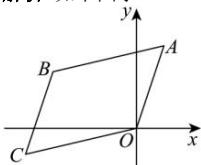

> [!faq]- 全练一本通解析
> **【答案】** 平行四边形, 理由见解析
>
> **【解析】**
> 如下图示:
> 
> OA 边所在直线的斜率 $k_{OA}=3$ , AB 边所在直线的斜率 $k_{AB}=\frac{1}{4}$ ,
> BC 边所在直线的斜率 $k_{BC}=3$ , CO 边所在直线的斜率 $k_{CO}=\frac{1}{4}$ .
> 由 $k_{BC} \neq k_{CO}$ 知: 点 O 不在 BC 上, 则 OA 与 BC 不重合, 又 $k_{OA} = k_{BC}$ , 得 OA // BC. 同理, 由 $k_{AB} = k_{CO}$ 且 AB 与 CO 不重合, 得 AB // CO. 因此四边形 OABC 是平行四边形.
