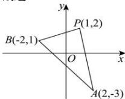

> [!faq]- 全练一本通解析
> **【解析】**
> $(- \infty, -5] \cup \left[\frac{1}{3}, +\infty\right)$
> 解析: 直线 l 过定点 $P(1,2)$ ，且与线段 AB 相交，如图所示，
> 则直线 PA 的斜率是 $k_{PA}=\frac{-3-2}{2-1}=-5$ 直线 PB 的斜率是 $k_{PB}=\frac{1-2}{-2-1}=\frac{1}{3}$ ,
> 则直线 l 与线段 AB 相交时, 它的斜率 k 的取值范围是 $k \geq \frac{1}{3}$ 或 $k \leq -5$ .
> 故选:A.
> 
