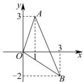

> [!faq]- 全练一本通解析
> **【解析】**
> $\left[-\frac{2}{3},3\right]$
> 解析:如图,当直线 l 分别经过 A, B 时为临界情况,
> $$
> k _ {O A} = \frac {3 - 0}{1 - 0} = 3, k _ {O B} = \frac {- 2 - 0}{3 - 0} = - \frac {2}{3}
> $$
> 当直线从 $OA$ 位置顺时针转动到 $OB$ 位置时，由倾斜角和斜率的关系可知 $k \in \left[-\frac{2}{3}, 3\right]$ .
> 
> 故答案为: $\left[-\frac{2}{3},3\right]$
