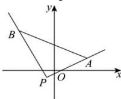

> [!faq]- 全练一本通解析
> **【答案】** $(-∞,-\frac{11}{6}]\cup[\frac{3}{7},+∞)$
>
> **【解析】**
> 由题意, 点 $A(2,1)$ , $B(-2,2)$ ，直线 l 过点 $P(-\frac{4}{5}, -\frac{1}{5})$ ,
> 可得直线 PA 的斜率为 $k_{PA}=\frac{1+\frac{1}{5}}{2+\frac{4}{5}}=\frac{3}{7}$ ，直线 PB 的斜率为 $k_{PB}=\frac{2+\frac{1}{5}}{-2+\frac{4}{5}}=-\frac{11}{6}$ ，如图所示，要使得直线 l 与线段 AB 有交点，
> 
> 则直线 l 的斜率 k 的取值范围为 $(-∞, -\frac{11}{6}]∪[\frac{3}{7}, +∞)$ .
> 故答案为： $(-∞,-\frac{11}{6}]∪[\frac{3}{7},+∞)$ .
