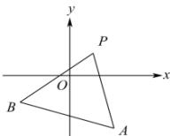

> [!faq]- 全练一本通解析
> **【答案】** $\left(-4,\frac{3}{4}\right)$
>
> **【解析】**
> $k_{PA}=\frac{1+3}{1-2}=-4$ ， $k_{PB}=\frac{1+2}{1+3}=\frac{3}{4}$
> 
> 直线 l 过点 $P(1,1)$ 且与线段 AB 不相交，故 $-4 < k < \frac{3}{4}$ ，即 $k \in \left(-4, \frac{3}{4}\right)$ .
> 故答案为： $\left(-4,\frac{3}{4}\right)$ .
