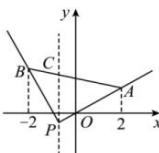

> [!faq]- 全练一本通解析
> **【解析】**
> $\left(-\frac{11}{6},\frac{3}{7}\right)$
> 解析: 设过点 P 且垂直于 x 轴的直线交线段 AB 于点 C, 如下图所示:
> 
> 当直线 l 由位置 PA 绕点 P 转动到位置 PC 时，l 的斜率从 $k_{PA}$ 逐渐变大，
> 此时， $k \geq k_{PA} = \frac{1 + \frac{1}{5}}{2 + \frac{4}{5}} = \frac{3}{7}$ ;
> 当直线 l 由位置 PC 绕点 P 转动到位置 PB 时，l 的斜率为负值，且逐渐增大至 $k_{PB}$ ，此时， $k \leq k_{PB} = \frac{2 + \frac{1}{5}}{-2 + \frac{4}{5}} = -\frac{11}{6}$ .
> 综上所述, 斜率 k 的取值范围是 $\left(-\infty, -\frac{11}{6}\right] \cup \left[\frac{3}{7}, +\infty\right)$ ,
> 所以直线 l 与线段 AB 没有交点时，其斜率 k 的取值范围是 $\left(-\frac{11}{6}, \frac{3}{7}\right)$ .
> 故答案为： $\left(-\frac{11}{6}, \frac{3}{7}\right)$ .
