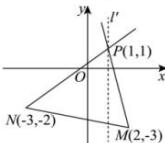

> [!faq]- 全练一本通解析
> **【解析】**
> $(-∞,-4]∪\left[\frac{3}{4},+∞\right)$ 解析: 如图所示, 直线 l 相当于绕着点 P 在直线 PM 与 PN 间旋转, $l'$ 是过 P 点且与 x 轴垂直的直线.
> 
> 当 l 从 PN 位置转到 $l'$ 位置时，倾斜角增大到 $90^{\circ}$ ，而 $k_{PN} = \frac{3}{4}$ ，所以 $k \geq \frac{3}{4}$ .
> 又当 l 从 $l'$ 位置转到 PM 位置时，倾斜角大于 $90^{\circ}$ ，
> 由正切函数的性质知， $k \leq k_{PM} = -4$ ，所以 $k \leq -4$ 。
> 综上所述， $k \in (-\infty, -4] \cup \left[\frac{3}{4}, +\infty\right)$ .
