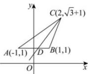

> [!faq]- 全练一本通解析
> **【解析】**
> （1）答案见解析（2） $\left[\frac{\sqrt{3}}{3},\sqrt{3}\right]$ 解析：（1）解：因为 $A(-1,1)$ ， $B(1,1)$ ， $C(2,\sqrt{3}+1)$ ，
> 由斜率公式，可得 $k_{AB}=\frac{1-1}{1-(-1)}=0,k_{BC}=\frac{\sqrt{3}+1-1}{2-1}=\sqrt{3},k_{AC}=\frac{\sqrt{3}+1-1}{2-(-1)}=\frac{\sqrt{3}}{3}$ 再由直线倾斜角的定义得：
> 直线 AB 的倾斜角为 $0^{\circ}$ ，直线 BC 的倾斜角为 $60^{\circ}$ ，直线 AC 的倾斜角为 $30^{\circ}$ .
> （2）如图所示，当直线 CD 由 CA 绕点 C 逆时针转到 CB 时，直线 CD 与线段 AB 恒有交点，
> 即 D 在线段 AB 上，此时 CD 的斜率 k 由 $k_{AC}$ 增大到 $k_{BC}$ ，
> 所以 k 的取值范围为 $\left[\frac{\sqrt{3}}{3},\sqrt{3}\right]$ .
> 
