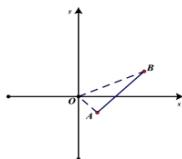

> [!faq]- 全练一本通解析
> **【答案】** $\frac{2}{3}$ ，-1
>
> **【解析】**
> 方程 $y=\frac{3}{2}x-\frac{5}{2}(1\leq x\leq3)$ 表示如图所示的线段:
> 
> 其中 $A(1, - 1),B(3,2)$ ， $\frac{y}{x}$ 表示线段上的点 $P(x,y)$ 与原点连线的斜率， $k_{OA} = \frac{-1 - 0}{1 - 0} = -1$ ， $k_{OB} = \frac{2 - 0}{3 - 0} = \frac{2}{3}$ 所以 $-1\leq \frac{y}{x}\leq \frac{2}{3}$ 所以 $\frac{y}{x}$ 的最大值为 $\frac{2}{3}$ ，最小值为-1，填 $\frac{2}{3}$ ，-1.
