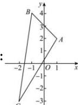

> [!faq]- 全练一本通解析
> **【解析】**
> $\left[\frac{5}{3},7\right]$
> 
> 如图， $A(1,2)$ ， $B(-1,4)$ ， $C(-2,-3)$ ，
> 则 $k_{AC}=\frac{-3-2}{-2-1}=\frac{5}{3}$ ， $k_{BC}=\frac{-3-4}{-2-(-1)}=7$ 。
> 因为 $\frac{y+3}{x+2}=\frac{y-(-3)}{x-(-2)}$ ，可表示点 C 与线段 AB 上任意一点 $M(x,y)$ 连线的斜率，由图象可知， $k_{AC}\leq k_{MC}\leq k_{BC}$ ，所以有 $\frac{5}{3}\leq\frac{y+3}{x+2}=k_{MC}\leq7$ 。故答案为： $\left[\frac{5}{3},7\right]$ .
