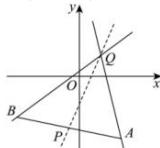
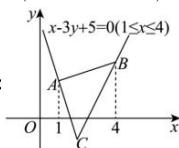

> [!faq]- 全练一本通解析
> **【解析】**
> $(-∞,-4]∪\left[\frac{3}{4},+\infty\right)$ 解析: 如图, 令 $Q(1,1)$ , 则 $\frac{y-1}{x-1}$ 的取值范围等价于直线 PQ 的斜率 k 的取值范围,
> 
> 
> ∵ 点 $A(2,-3)$ ， $B(-3,-2)$ ，点 $P(x,y)$ 是线段 AB （含端点）上任一点，
> ∴ $k_{AQ} = \frac{1 + 3}{1 - 2} = -4$ ， $k_{BQ} = \frac{1 + 2}{1 + 3} = \frac{3}{4}$ ∴ $k \geq \frac{3}{4}$ 或 $k \leq -4$ ∴ $\frac{y-1}{x-1}$ 的取值范围是 $(-∞,-4] ∪ \left[\frac{3}{4},+∞\right)$ .
