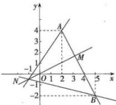

> [!faq]- 全练一本通解析
> **【答案】** $\left[-\frac{1}{2}, 3\right]$
>
> **【解析】**
> $\frac{2y+1}{x+1} = 2 \times \frac{y+\frac{1}{2}}{x+1}$ ，而 $\frac{y+\frac{1}{2}}{x+1} = \frac{y-\left(-\frac{1}{2}\right)}{x-(-1)}$ 的几何意义是过 $M(x,y)$ ， $N\left(-1, -\frac{1}{2}\right)$ 两点的直线的斜率。由于点 $M$ 在函数 $y=-2x+8$ 的图像上，且 $x \in [2,5]$ ，所以点 $M$ 在线段 $AB$ 上，且 $A(2,4), B(5,-2)$ ，如图。
> 
> 由于 $k_{NA} = \frac{3}{2}, k_{NB} = -\frac{1}{4}$ 所以 $-\frac{1}{4} \leqslant \frac{y + \frac{1}{2}}{x + 1} \leqslant \frac{3}{2}$ 故 $-\frac{1}{2} \leqslant \frac{2y + 1}{x + 1} \leqslant 3$ 即 $\frac{2y + 1}{x + 1}$ 的取值范围是 $\left[-\frac{1}{2}, 3\right]$ .
