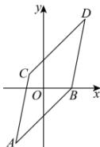
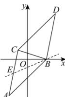

> [!faq]- 全练一本通解析
> **【答案】** （1） $1, \frac{\pi}{4}$ （2） $(3,5)$ ， $x - y + 2 = 0$ （3） $\left[-\frac{1}{3}, 1\right]$
>
> **【解析】**
> （1）由题意得直线 AB 的斜率为 $\frac{-4}{-2-2}=1$ ，所以直线 AB 的倾斜角为 $\frac{\pi}{4}$ ;
> （2）点 D 在第一象限时， $k_{AB}=k_{CD},k_{AC}=k_{BD}$
> 
> 设 $D(x,y)$ ，则 $\left\{\frac{y-1}{x+1}=1\right.$ $\frac{y}{x-2}=\frac{1+4}{-1+2}$ ，解得 $\left\{\begin{aligned}x=3\\ y=5\end{aligned}\right.$ 故点 D 的坐标为 $(3,5)$ ;
> （3）由题意得 $\frac{y}{x-2}$ 为直线 BE 的斜率，
> 当点 E 与点 C 重合时，直线 BE 的斜率最小， $k_{BC}=\frac{1}{-1-2}=-\frac{1}{3}$ ;
> 
> 当点 $E$ 与点 $A$ 重合时，直线 $BE$ 的斜率最大， $k_{AB} = 1$ ；故直线 $BE$ 的斜率的取值范围为 $\left[-\frac{1}{3}, 1\right]$ ，即 $\frac{y}{x - 2}$ 的范围为 $\left[-\frac{1}{3}, 1\right]$
