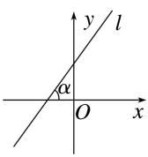
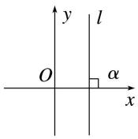
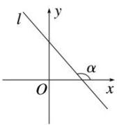
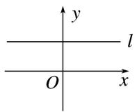

## 1. 直线倾斜角的定义

在平面直角坐标系中, 当直线 l 与 x 轴相交时, 我们以 x 轴为基准, x 轴正向与直线 l 向上的方向之间所成的角叫做直线 l 的倾斜角.

<table><tr><td></td><td></td><td></td><td></td></tr><tr><td>锐角</td><td>直角</td><td>钝角</td><td>零角</td></tr></table>

注意: (1) 当直线和 $x$ 轴平行或重合时, 规定直线倾斜角为 $0^{\circ}$ , 所以倾斜角 $\alpha$ 的范围是 $0^{\circ} \leq \alpha < 180^{\circ}$ .

（2）直线的倾斜角体现了直线相对于 x 轴正向的倾斜程度.

（3）在平面直角坐标系中,每一条直线都有一个确定的倾斜角

（4）倾斜角相同, 未必表示同一条直线.
