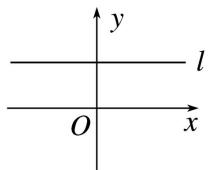
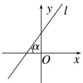
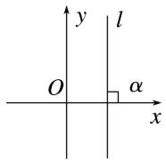
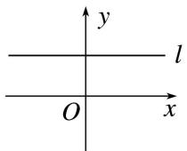

## 4. 斜率与倾斜角的关系

<table><tr><td>倾斜角</td><td>零角</td><td>锐角</td><td>直角</td><td>钝角</td></tr><tr><td>斜率</td><td>等于0</td><td>大于0</td><td>不存在</td><td>小于0</td></tr><tr><td>图形</td><td></td><td></td><td></td><td></td></tr><tr><td>斜率与倾斜角的关系</td><td>直线平行于x轴或与x轴重合</td><td>直线的斜率k随着倾斜角的增大而增大</td><td>直线垂直于x轴</td><td>直线的斜率k随着倾斜角的增大而增大</td></tr></table>
