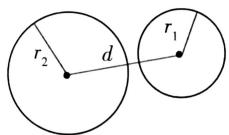
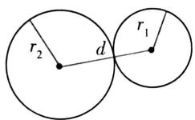
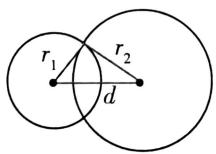
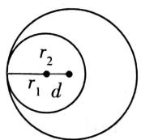
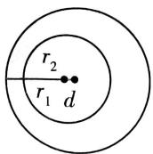

## (1) 几何法

设两圆圆心分别为 $O_{1}, O_{2}$ ，半径分别为 $r_{1}, r_{2}$ ，且 $r_{2} > r_{1}, \left|O_{1}O_{2}\right| = d$ ，则

<table><tr><td>位置关系</td><td>相离</td><td>外切</td><td>相交</td><td>内切</td><td>内含</td></tr><tr><td>图示</td><td></td><td></td><td></td><td></td><td></td></tr><tr><td>距离关系</td><td> $d >r_1 + r_2$ </td><td> $d = r_1 + r_2$ </td><td> $r_2 - r_1 < d < r_1 + r_2$ </td><td> $d = r_2 - r_1$ </td><td> $d < r_2 - r_1$ </td></tr><tr><td>公切线数</td><td>4条</td><td>3条</td><td>2条</td><td>1条</td><td>无</td></tr></table>
