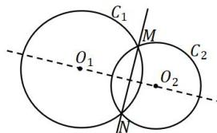
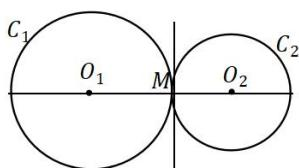
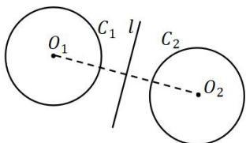

## 3. 圆系方程

（1）经过圆 $C: x^{2} + y^{2} + Dx + Ey + F = 0$ 与直线 $l: ax + by + c = 0$ 的两个交点的圆的方程可设为：

$x^{2} + y^{2} + Dx + Ey + F + \lambda (ax + by + c) = 0$ .整理得 $x^{2} + y^{2} + (D + \lambda a)x + (E + \lambda b)y + F + \lambda c = 0$

（2）经过圆 $C_1: x^2 + y^2 + D_1x + E_1y + F_1 = 0$ 与圆 $C_2: x^2 + y^2 + D_2x + E_2y + F_2 = 0$ 的两个交点的圆的方程可设为： $x^2 + y^2 + D_1x + E_1y + F_1 + \lambda(x^2 + y^2 + D_2x + E_2y + F_2) = 0$ .

## 【当 $\lambda = -1$ 时, 即两圆相减时, 分为以下三种情况】

①当两圆相交时, 它为公共弦所在直线方程;

②当两圆相切时,它为公切线方程;

③当两圆相离或包含时, 它为到两圆的切线段相等的点的集合; 显然, 当两圆相离且半径相等时, 它为两圆的对称轴.

（3）与圆 $C: x^{2} + y^{2} + Dx + Ey + F = 0$ 相切于点 $(x_{0}, y_{0})$ 的圆的方程可设为：

$x^{2}+y^{2}+Dx+Ey+F+\lambda\left[\left(x-x_{0}\right)^{2}+\left(y-y_{0}\right)^{2}\right]=0$ 【把切点当点圆就可理解此方程】
