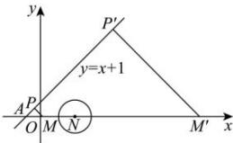

> [!faq]- 全练一本通解析
> **【答案】** D
>
> **【解析】**
> 解析:如图, 过点 M 作直线 $y = x + 1$ 的垂线, 垂足为 P, 设圆 M 的半径为 r, 直线 $y = x + 1$ 的倾斜角为 $45^{\circ}$ , 点 A 的坐标为 $(-1, 0)$ ,
> 
> 若点 M 在点 N 左侧，则有 $\sqrt{2}|PM| + |MN| = 3$ ，
> 即 $r+1+\sqrt{2}r=3$ ，解得 $r=\frac{2}{\sqrt{2}+1}=2\sqrt{2}-2$ ；
> 若点 M（记为 $M'$ ）在点 N 右侧， $M'P'$ 垂直于 $y=x+1$ ，则 $\sqrt{2}\left|P'M'\right|-\left|M'N\right|=3$ ，即 $\sqrt{2}r-r-1=3$ ，解得 $r=\frac{4}{\sqrt{2}-1}=4\sqrt{2}+4$ ；
> 所以 r 的值为 $2\sqrt{2}-2$ 或 $4\sqrt{2}+4$ ，故选：D.
