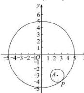

> [!faq]- 全练一本通解析
> **【解析】**
> $\left(x-\frac{12}{5}\right)^{2}+\left(y+\frac{16}{5}\right)^{2}=1$ 解析:设所求圆的圆心为 $A(a,b)$ ，
> 圆的 $x^{2}+y^{2}=25$ 的半径为 5，圆心为坐标原点 O，
> 因为圆 O 和圆 A 相内切，
> 所以 $|OA|=5-1=4\Rightarrow\sqrt{a^{2}+b^{2}}=4$ ①，
> 又因为两圆内切于点 $P(3,-4)$ ，
> 所以 O,P,A 三点共线，因此有 $\frac{b}{a}=\frac{-4}{3}$ ②，
> 由①②可解 $\left\{\begin{aligned}a&=\frac{12}{5}\\ b&=-\frac{16}{5}\end{aligned}\right.$ 或 $\left\{\begin{aligned}a&=-\frac{12}{5}\\ b&=\frac{16}{5}\end{aligned}\right.$ ，
> 因为点 $P(3-A)$ 在第四象限
> 
> 所以点 A 也在第四象限, 所以 $\left\{\begin{aligned}a &= \frac{12}{5}\\ b &= -\frac{16}{5}\end{aligned}\right.$ 因此所求圆的方程为 $\left(x-\frac{12}{5}\right)^{2}+\left(y+\frac{16}{5}\right)^{2}=1$ .
