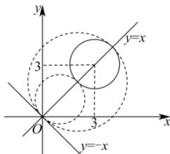

> [!faq]- 全练一本通解析
> **【解析】**
> 详见解析
> 解析: 设圆心为 $(m,m)$ ，则半径 $r=\frac{|m+m|}{\sqrt{2}}=\sqrt{2}|m|$ ,
> 假设与圆 $(x-3)^{2}+(y-3)^{2}=2$ 外切，则 $\sqrt{(m-3)^{2}+(m-3)^{2}}=\sqrt{2}+\sqrt{2}|m|$ ，
> 所以 $|m-3|=1+|m|$ ，故 $m^{2}-6m+9=m^{2}+2|m|+1$ ，则 $3m+|m|=4$ ，
> 若 m>0，则 $4m=4\Rightarrow m=1$ ，则圆心为 $(1,1)$ ，半径为 $r=\sqrt{2}$ ，故 $(x-1)^{2}+(y-1)^{2}=2$ ;
> 若 m<0，则 $2m=4\Rightarrow m=2$ ，不满足前提；
> 假设与圆 $(x-3)^{2}+(y-3)^{2}=2$ 内切，又 $(3,3)$ 与 y=-x 的距离为 $\frac{6}{\sqrt{2}}=3\sqrt{2}>\sqrt{2}$ 此时，圆 $(x-3)^{2}+(y-3)^{2}=2$ 内切于所求圆，则 $\sqrt{(m-3)^{2}+(m-3)^{2}}=\sqrt{2}|m|-\sqrt{2}$ 所以 $|m-3|=|m|-1$ ，故 $m^{2}-6m+9=m^{2}-2|m|+1$ ，则 $3m-|m|=4$ ，
> 若 m>0，则 $2m=4\Rightarrow m=2$ ，则圆心为 $(2,2)$ ，半径为 $r=2\sqrt{2}$ ，故 $(x-2)^{2}+(y-2)^{2}=8$ ;
> 若 m<0，则 $4m=4\Rightarrow m=1$ ，不满足前提；
> 综上， $(x-1)^{2}+(y-1)^{2}=2$ 或 $(x-2)^{2}+(y-2)^{2}=8$
> 
