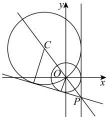

> [!faq]- 全练一本通解析
> **【答案】** 2条；x=2或7x+24y+50=0
>
> **【解析】**
> 圆 $x^{2}+y^{2}-4=0$ 的圆心为 $O(0,0)$ ，半径 $r_{1}=2$ ， $x^{2}+y^{2}+6x-8y=0$ 化为标准方程得 $(x+3)^{2}+(y-4)^{2}=25$ ，圆心为 $C(-3,4)$ ，半径 $r_{2}=5$ ，
> 如图，易知两圆相交，公切线有两条，其中一条为 x=2，
> 直线 OC 的斜率为 $k_{OC}=-\frac{4}{3}$ ，直线 OC 方程为 $y=-\frac{4}{3}x$ ，
> 联立 $\left\{\begin{aligned}&y=-\frac{4}{3}x\\&x=2\end{aligned}\right.$ 解得 $P\left(2,-\frac{8}{3}\right)$ ，
> 易知另一条公切线 l 的斜率存在，设方程为 $y+\frac{8}{3}=k(x-2)$ ，即 $kx-y-2k-\frac{8}{3}=0$ ，
> 则 $\left|\frac{-2k-\frac{8}{3}}{\sqrt{k^{2}+1}}\right|=2$ ，解得 $k=-\frac{7}{24}$ ，
> 则公切线 l 的方程为 $y+\frac{8}{3}=-\frac{7}{24}(x-2)$ ，即 $7x+24y+50=0$ 。
> 故答案为：x=2 或 $7x+24y+50=0$ （写一条即可）
> 
