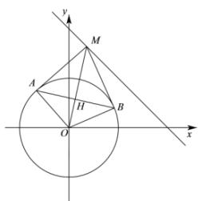

> [!faq]- 全练一本通解析
> **【答案】** B
>
> **【解析】**
> 解析: 圆 $O: x^{2} + y^{2} = 4$ 的圆心为原点，半径为 r = 2，
> 因为 $AO \perp AM, BO \perp BM$ ，故 A, B, O, M 四点共圆，且 OM 为直径，
> 设 $M(m,4-m)$ ，则 $OM=\sqrt{m^{2}+(4-m)^{2}}$ 线段 OM 的中点坐标为 $\left(\frac{m}{2},\frac{4-m}{2}\right)$ ，
> 故以 OM 为直径的圆的方程为 $\left(x-\frac{m}{2}\right)^{2}+\left(y-\frac{4-m}{2}\right)^{2}=\left(\frac{\sqrt{m^{2}+\left(4-m\right)^{2}}}{2}\right)^{2}$ 整理得： $x^{2}-mx+y^{2}-(4-m)y=0$ $x^{2}-mx+y^{2}-(4-m)y=0$ 与 $O:x^{2}+y^{2}=4$ 相减得：
> 直线 AB 的方程为 $mx + (4 - m)y - 4 = 0$ 整理为 $m(x-y)+4y-4=0$ 令 $\left\{\begin{aligned}x-y=0\\ 4y-4=0\end{aligned}\right.$ ，解得： $\left\{\begin{aligned}x=1\\ y=1\end{aligned}\right.$ 即直线 AB 恒过点 $D(1,1)$
> 
> 要想线段 $AB$ 取得最小值，只需 $OD \perp AB$ ，即 $D$ 为 $AB$ 的中点，其中 $OD = \sqrt{1 + 1} = \sqrt{2}$ ，则 $AB = 2\sqrt{r^2 - OD^2} = 2\sqrt{2}$ ，
>
> 故选 **B**
