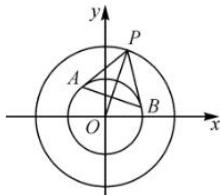

> [!faq]- 全练一本通解析
> **【答案】** B
>
> **【解析】**
> 解析：设圆 $x^2 + y^2 = 25$ 的动点为 $P(m, n)$ ，过点 $P$ 作圆 $C$ 的切线，切点分别为 $A, B$ ，则过点 $P, A, B$ 的圆是以 $PO$ 直径的圆，该圆的方程为 $x(x - m) + y(y - n) = 0$ 。由 $\left\{ \begin{array}{l} x^2 + y^2 = 9 \\ x(x - m) + y(y - n) = 0 \end{array} \right.$ ，可得 $AB$ 的直线方程为 $mx + ny = 9$ 。
> 
> 原点到直线 $mx + ny = 9$ 的距离为 $\frac{9}{\sqrt{m^{2} + n^{2}}} = \frac{9}{\sqrt{25}} = \frac{9}{5}$ ,
> 故圆 C 不在任何切点弦上的点形成的区域的周长为 $\frac{18}{5}\pi$ ，故选：B.
